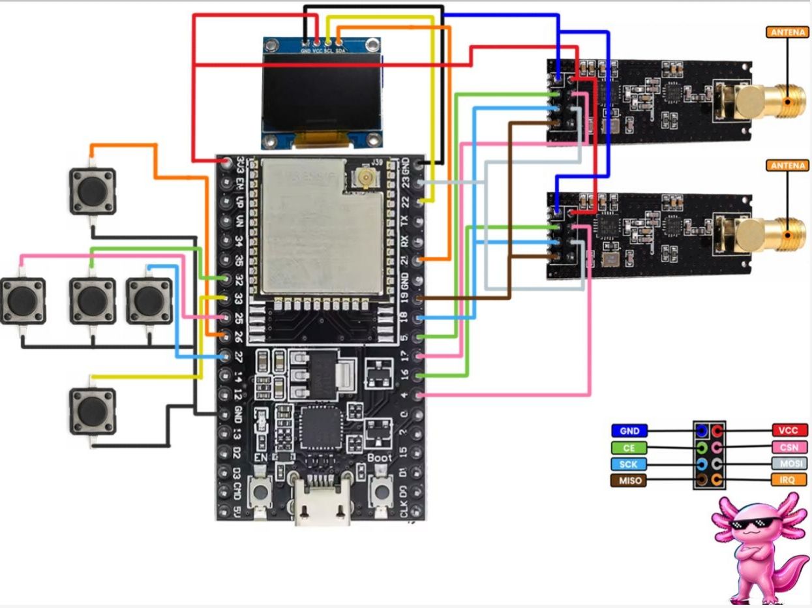

# BWifiKill ESP32 V4.0


[](https://pepeangell5.github.io/BWifiKill-ESP32-V4.0/)
[](https://github.com/pepeangell5)
[](https://www.instagram.com/pepeangelll)
[](https://www.facebook.com/esp32tools)

BWifiKill ESP32 V4.0 es una suite portatil para laboratorio, aprendizaje y auditoria autorizada de redes WiFi, Bluetooth y actividad RF en 2.4 GHz. Esta version reorganiza el firmware por categorias, mejora la interfaz OLED, agrega herramientas pasivas nuevas y deja el proyecto listo para instalar por Web Flasher o PlatformIO.

> Uso responsable: algunas funciones estan pensadas solo para laboratorio controlado. No uses este firmware contra redes, dispositivos o personas sin permiso explicito.

<p align="center">
  
</p>

## Indice

- [Novedades V4.0](#novedades-v40)
- [Hardware necesario](#hardware-necesario)
- [Conexion del hardware](#conexion-del-hardware)
- [Galeria](#galeria)
- [Funciones del firmware](#funciones-del-firmware)
- [Instalacion y flasheo](#instalacion-y-flasheo)
- [Estructura del proyecto](#estructura-del-proyecto)
- [Diferencias V3.3 vs V4.0](#diferencias-v33-vs-v40)
- [Redes sociales](#redes-sociales)
- [Disclaimer](#disclaimer)
- [Licencia](#licencia)

## Novedades V4.0

- Menu principal por categorias: WiFi, RF Tools, Bluetooth, Ilegal, Games y Sistema.
- Interfaz OLED renovada con headers, iconos, animaciones y mejor uso del espacio.
- Nuevas herramientas WiFi: WiFi Radar y Channel Scan.
- Nuevas herramientas RF pasivas: RF Heatmap, CH Advisor, BT/WiFi Coex View y Dual nRF Oscilloscope.
- Nuevas herramientas nRF entre dispositivos propios: nRF Link y nRF Chat.
- Bluetooth Scanner mejorado con fabricante, RSSI y vista de detalles.
- BT Analyzer y BT Spectrum para lectura visual de actividad BLE.
- IP Scanner mejorado con lista de hosts detectados y acciones de diagnostico.
- Nueva funcion restringida Deauther para laboratorio propio y pruebas autorizadas.
- Juegos reorganizados dentro de Arcade.
- Web Dashboard con AP dedicado: `BWifiKill_V4`, password `bwifikill40`, IP `192.168.4.1`.

<p align="center">
  
</p>

<p align="right"><a href="#indice">Regresar al indice</a></p>

## Hardware necesario

| Componente | Cantidad | Notas |
| --- | ---: | --- |
| ESP32 DevKit / ESP32-WROOM | 1 | Placa principal del firmware. |
| Pantalla OLED SSD1306 I2C 128x64 | 1 | Direccion comun `0x3C`. |
| Modulo nRF24L01+ | 2 | Recomendado con capacitor de 10 uF a 100 uF entre VCC y GND. |
| Botones tactiles | 5 | UP, DOWN, OK, BACK y AUX. |
| Bateria LiPo | 1 | Opcional para hacerlo portatil. |
| TP4056 | 1 | Carga de bateria LiPo. |
| Step-up 5V | 1 | Alimentacion estable para ESP32 si usas bateria. |
| Interruptor | 1 | Encendido general. |
| PCB / protoboard / cables | 1 | Segun tu montaje. |

<p align="center">
  
  
  
  
</p>

<p align="right"><a href="#indice">Regresar al indice</a></p>

## Conexion del hardware

### Diagrama general

<p align="center">
  
</p>

<p align="center">
  
</p>

### Pantalla OLED SSD1306

| OLED | ESP32 | Nota |
| --- | --- | --- |
| VCC | 3V3 | Usa 3.3V si tu modulo lo permite. |
| GND | GND | Tierra comun con todo el circuito. |
| SDA | GPIO 21 | Bus I2C datos. |
| SCL | GPIO 22 | Bus I2C reloj. |

### Botones

Los botones van entre el GPIO y GND. El firmware usa `INPUT_PULLUP`, por eso no necesitas resistencia externa si usas este cableado.

| Boton | GPIO | Funcion |
| --- | ---: | --- |
| UP | 26 | Navegar arriba / subir valor. |
| DOWN | 33 | Navegar abajo / bajar valor. |
| OK | 32 | Entrar / confirmar / iniciar. |
| BACK | 25 | Volver / salir. |
| AUX | 27 | Accion secundaria segun la app. |

### Modulos nRF24L01+

Los dos nRF comparten el bus SPI. Solo cambian `CE` y `CSN`.

| Pin nRF24 | ESP32 | Nota |
| --- | --- | --- |
| VCC | 3V3 | Nunca alimentar con 5V. |
| GND | GND | Tierra comun. |
| SCK | GPIO 18 | SPI clock. |
| MISO | GPIO 19 | SPI MISO. |
| MOSI | GPIO 23 | SPI MOSI. |
| CE NRF1 | GPIO 5 | Control del primer nRF. |
| CSN NRF1 | GPIO 17 | Chip select del primer nRF. |
| CE NRF2 | GPIO 16 | Control del segundo nRF. |
| CSN NRF2 | GPIO 4 | Chip select del segundo nRF. |

<p align="center">
  
  
</p>

### Alimentacion portatil

| Modulo | Conexion recomendada |
| --- | --- |
| Bateria LiPo | A `B+` y `B-` del TP4056. |
| TP4056 OUT+ / OUT- | Entrada del interruptor y step-up. |
| Step-up 5V | A `VIN/5V` y `GND` del ESP32. |
| nRF24 | Siempre a `3V3`, no al step-up de 5V. |

<p align="center">
  
  
  
  
</p>

<p align="right"><a href="#indice">Regresar al indice</a></p>

## Galeria

### WiFi

| Categoria | WiFi Scanner | WiFi Radar | Channel Scan |
| --- | --- | --- | --- |
|  |  |  |  |

| Packet Monitor | Modo Centinela | IP Scanner | Web Dashboard |
| --- | --- | --- | --- |
|  |  |  |  |

### RF Tools

| Categoria | Analizador | RF Heatmap | CH Advisor |
| --- | --- | --- | --- |
|  |  |  |  |

| nRF Link | nRF Chat | BT/WiFi Coex | Dual nRF Scope |
| --- | --- | --- | --- |
|  |  |  |  |

### Bluetooth

| Categoria | BT Scanner | BT Analyzer |
| --- | --- | --- |
|  |  |  |

| BT Spectrum | BT Remote |
| --- | --- |
|  |  |

### Zona restringida

| Categoria | Jammer Canal | Barrido Total | BT Jammer |
| --- | --- | --- | --- |
|  |  |  |  |

| Beacon Spam | BLE Spam | Modo Hibrido | Evil Portal |
| --- | --- | --- | --- |
|  |  |  |  |

### Games

| Categoria | Snake | Pong |
| --- | --- | --- |
|  |  |  |

| Flappy | Invaders | Dino |
| --- | --- | --- |
|  |  |  |

### Sistema

| Categoria | Control Esclavo | Leer Logs | About |
| --- | --- | --- | --- |
|  |  |  |  |

<p align="right"><a href="#indice">Regresar al indice</a></p>

## Funciones del firmware

### WiFi

| Funcion | Descripcion corta |
| --- | --- |
| WiFi Scanner | Escanea redes cercanas, muestra SSID, canal, RSSI y seguridad. Permite conectar redes abiertas para diagnostico. |
| WiFi Radar | Selecciona un AP y muestra una lectura visual de cercania basada en RSSI, actualizandose al moverte. |
| Channel Scan | Cuenta APs por canal, lista redes por canal y muestra detalles de cada AP. |
| Packet Monitor | Vista grafica de paquetes WiFi en modo monitor para observar actividad del entorno. |
| Modo Centinela | Vigila actividad anomala y muestra intensidad con barra para detectar cambios fuertes de RF o gestion WiFi. |
| IP Scanner | Escanea la red local conectada, lista hosts encontrados y permite diagnosticos basicos como ping. |
| Web Dashboard | Levanta un AP local para ver estado, descargar logs y administrar datos desde el navegador. |

### RF Tools

| Funcion | Descripcion corta |
| --- | --- |
| Analizador | Espectro RF general en 2.4 GHz con sensibilidad ajustada y alertas visuales. |
| RF Heatmap | Mapa pasivo de energia RF por zonas, util para ver actividad acumulada. |
| CH Advisor | Recomienda canales WiFi/nRF menos ruidosos segun lectura pasiva de los nRF24. |
| nRF Link | Prueba comunicacion entre dos dispositivos BWifiKill con rol maestro/esclavo. |
| nRF Chat | Envia mensajes predefinidos entre dos ESP32 con nRF24 para pruebas propias. |
| BT/WiFi Coex View | Compara zonas tipicas WiFi y BLE para ver como se enciman en 2.4 GHz. |
| Dual nRF Scope | Usa dos nRF24 como sondas simultaneas, una para canales bajos y otra para altos. |

### Bluetooth

| Funcion | Descripcion corta |
| --- | --- |
| BT Scanner | Escanea dispositivos Bluetooth/BLE y muestra nombre, fabricante, MAC, RSSI y detalles. |
| BT Analyzer | Analiza actividad BLE por dispositivo, con grafica y vista de detalles. |
| BT Spectrum | Vista de actividad BLE/RF enfocada en 2402-2480 MHz. |
| BT Remote | Control remoto BLE HID para pruebas con dispositivos propios emparejados. |

### Zona restringida / laboratorio

Estas funciones existen para pruebas controladas y educacion. No deben ejecutarse en redes, dispositivos o espacios donde no tengas autorizacion.

| Funcion | Descripcion corta |
| --- | --- |
| Jammer Canal | Prueba de interferencia RF sobre un canal seleccionado en laboratorio. |
| Barrido Total | Prueba RF de barrido amplio en 2.4 GHz para entorno aislado. |
| BT Jammer | Prueba de interferencia enfocada a zona Bluetooth en laboratorio. |
| Beacon Spam | Genera beacons WiFi de prueba para analizar comportamiento de scanners. |
| BLE Spam (POP) | Emision BLE de laboratorio para revisar respuesta de dispositivos propios. |
| Modo Hibrido | Combina pruebas WiFi/RF en un flujo de laboratorio controlado. |
| Evil Portal | Portal cautivo local para capacitacion y pruebas autorizadas de concientizacion. |
| Deauther | Funcion de laboratorio para pruebas controladas de gestion WiFi en redes propias o con autorizacion explicita. |

### Games

| Juego | Descripcion corta |
| --- | --- |
| Snake | Juego clasico de serpiente con control por botones. |
| Pong | Pong contra CPU con limites de pantalla corregidos. |
| Flappy | Juego de salto con obstaculos ajustados al area visible. |
| Invaders | Mini arcade de disparos en OLED. |
| Dino | Runner estilo dinosaurio para probar controles y pantalla. |

### Sistema

| Funcion | Descripcion corta |
| --- | --- |
| Control Esclavo | Controla un segundo dispositivo compatible en modo esclavo para pruebas propias. |
| Leer Logs | Visor local de logs guardados en memoria interna. |
| About | Informacion de version, autor y redes sociales. |

<p align="right"><a href="#indice">Regresar al indice</a></p>

## Instalacion y flasheo

### Metodo 1: Web Flasher

1. Abre el instalador web desde Chrome o Edge:
   [Abrir Web Flasher BWifiKill V4.0](https://pepeangell5.github.io/BWifiKill-ESP32-V4.0/)
2. Conecta el ESP32 por USB.
3. Presiona `Instalar BWifiKill V4.0`.
4. Selecciona el puerto serial.
5. Si el flasheo no inicia, manten presionado `BOOT` mientras empieza la escritura.

### Metodo 2: binario completo con esptool

Usa el archivo:

```bash
binarios/BWifiKill-ESP32-V4.0-full.bin
```

Comando recomendado:

```bash
esptool.py --chip esp32 --baud 921600 write_flash 0x0 binarios/BWifiKill-ESP32-V4.0-full.bin
```

### Metodo 3: PlatformIO

```bash
git clone https://github.com/pepeangell5/BWifiKill-ESP32-V4.0.git
cd BWifiKill-ESP32-V4.0
pio run
pio run -t upload
```

Si usas VS Code:

1. Instala la extension PlatformIO.
2. Abre la carpeta del proyecto.
3. Conecta el ESP32.
4. Presiona `Upload`.

<p align="right"><a href="#indice">Regresar al indice</a></p>

## Estructura del proyecto

```text
BWifiKill-ESP32-V4.0/
|-- include/              Headers del firmware
|-- src/                  Codigo fuente
|-- img/
|   |-- componentes/      Fotos de piezas, pines y conexiones
|   |-- diagramas/        Diagramas explicativos
|   `-- Firmware/         Capturas organizadas por categoria
|-- binarios/             Binarios listos para flashear
|-- index.html            Web Flasher
|-- manifest.json         Manifest de ESP Web Tools
|-- platformio.ini        Configuracion PlatformIO
|-- LICENSE               Licencia MIT
`-- README.md             Documentacion principal
```

<p align="right"><a href="#indice">Regresar al indice</a></p>

## Diferencias V3.3 vs V4.0

| Area | V3.3 | V4.0 |
| --- | --- | --- |
| Menu | Lista lineal de apps | Categorias con iconos y submenus. |
| UI | Pantallas mas simples | Headers, animaciones, mejor distribucion y menos texto innecesario. |
| WiFi | Scanner, monitor, centinela, IP scanner | Agrega WiFi Radar y Channel Scan; mejora IP Scanner. |
| Bluetooth | Scanner y BT Remote base | Mejora scanner, agrega BT Analyzer y BT Spectrum. |
| RF | Analizador y pruebas con nRF | Agrega Heatmap, CH Advisor, Coex View y Dual nRF Scope. |
| Comunicacion nRF | No era foco principal | Agrega nRF Link y nRF Chat entre dispositivos propios. |
| Documentacion | Basica | README profesional, tablas, imagenes, flasher y binarios. |

<p align="right"><a href="#indice">Regresar al indice</a></p>

## Redes sociales

- Instagram: [@pepeangelll](https://www.instagram.com/pepeangelll)
- GitHub: [pepeangell5](https://github.com/pepeangell5)
- Facebook: [esp32tools](https://www.facebook.com/esp32tools)

<p align="right"><a href="#indice">Regresar al indice</a></p>

## Disclaimer

Este firmware se publica con fines educativos, de investigacion, aprendizaje de electronica, analisis RF y auditoria autorizada. El usuario es responsable de cumplir las leyes de su pais y de obtener permiso antes de realizar cualquier prueba sobre redes o dispositivos que no sean propios.

El autor no se hace responsable por danos, interrupciones, perdida de datos, uso indebido o consecuencias legales derivadas del uso de este proyecto.

<p align="right"><a href="#indice">Regresar al indice</a></p>

## Licencia

Distribuido bajo licencia MIT. Consulta [LICENSE](LICENSE) para mas detalles.

<p align="right"><a href="#indice">Regresar al indice</a></p>
